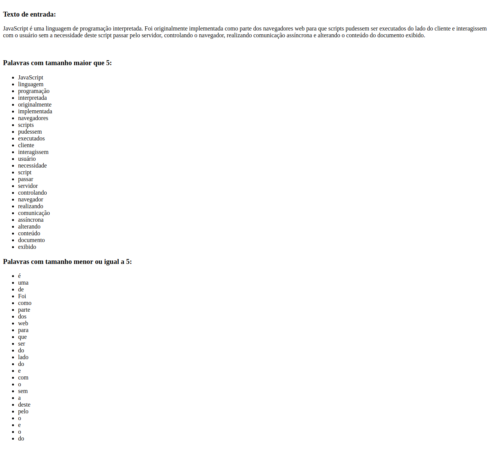

# Curso JS - Desafio 1

* Resolva o desafio utilizando os conceitos de JavaScript estudados até o momento.

## Como participar

* Crie um novo fork e branch com seu nome-sobrenome e faça um pull request quando estiver pronto. Iremos fazer code review.

## O desafio

* Trata-se de pegar um texto no documento e extrair a palavras com tamanho maior que 5 caracteres e escrevê-las em uma lista. E de modo análogo pegar as palavras menores ou iguais a 5 e escrevê-las em outra lista.

### Exemplo:

* Observação: as palavras não devem possuir pontos ou vírgulas.

